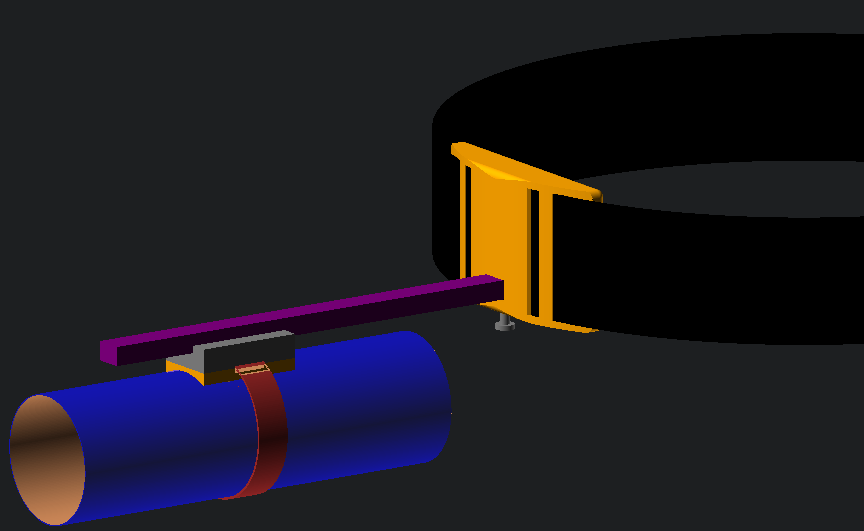
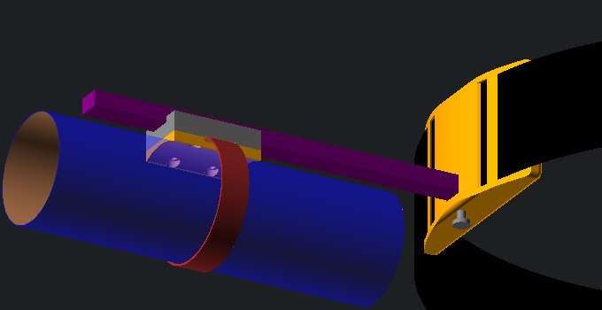
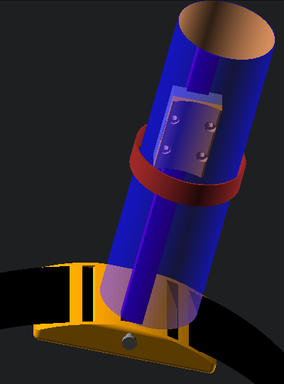
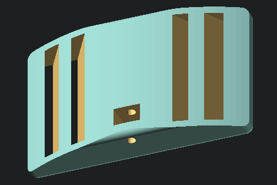
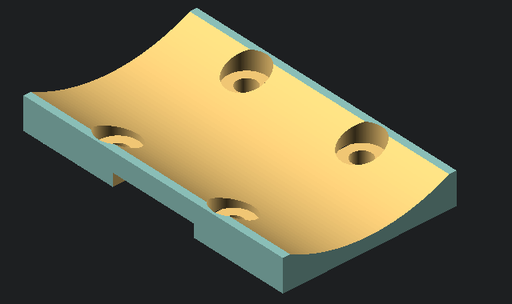

# OSSMount
#### A sliding mount for hands free operation of your stroker device

## Making:
It's really just a couple 3d printed parts, a belt, a linear bearing, a screw, and a velcro strap. It can be had for less than $30.

In this rendering:
- the purple is a [standard MGN12H linear rail](https://www.amazon.com/MGN12H-Linear-Carriage-Printer-Machines/dp/B0BYVBMBFQ)
- the red is [a cut piece of 1/2" velcro strap](https://www.amazon.com/dp/B0CL6HVZ13)
- the blue is [a venus style receiver](https://github.com/RubberyFun/OSSM-Job/blob/main/STL/OSSM-Job-Receiver-M-thin%20wall.stl)
- the bigger orange part is [a 3d printed "belt buckle"](bearing_buckle.stl)
- the black is [a belt](https://www.amazon.com/Transfer-Occupational-Pediatric-Caregiver-Therapist/dp/B09JVHKQVZ) which has a few options for threading.
- [the smaller orange part](car_strap.stl) pinches the strap against the linear rail car
- [a M4x20 screw](https://www.amazon.com/mxuteuk-450PCS-Screws-Assortment-Socket/dp/B0CS67BLQJ) secures the rail to the buckle
- [4 M3x5 screws](https://www.amazon.com/mxuteuk-450PCS-Screws-Assortment-Socket/dp/B0CS67BLQJ) secure the strap to the linear rail car.

## More images:

 

## Tips:
- For a sturdier mount [get a slightly longer linear bearing with two cars](https://www.amazon.com/Iverntech-Linear-MGN12H-Carriage-Printer/dp/B0885XJT3L) and attach 2 straps.
- use a [2" gait belt](https://www.amazon.com/Transfer-Occupational-Pediatric-Caregiver-Therapist/dp/B09JVHKQVZ) 
- use an [OSSM-Job](https://github.com/RubberyFun/OSSM-Job) and control it with [OSSM-Possum](https://github.com/RubberyFun/OSSM-Possum)!

### Why the name?
- This is was designed with the [OSSM-Job](https://github.com/RubberyFun/OSSM-Job) in mind.  It's modification of the [Open Source Sex Machine](https://github.com/KinkyMakers/OSSM-hardware) to function as a stroker that surpasses the Venus 2000, Serious Kit, Tremblr, VacuGlide, etc...  Why?  Because it was designed to control the nuances of a penetrative sex machine built by a thriving open-source community.  It turns out that same versatility in power and patterns gives a much richer variety of sensations and control options than simply changing speed from slow to fast, which is all the others can do.
